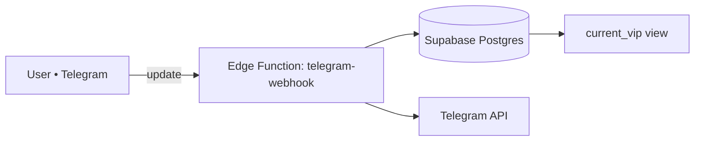
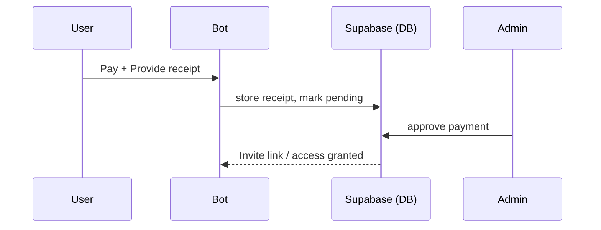

# Flow Overview

## A) Request Flow (Telegram → Edge → DB → Telegram)

```mermaid
flowchart LR
  TG[User • Telegram] -->|update| WH[Edge Function: telegram-webhook]
  WH --> SB[(Supabase Postgres)]
  SB --> VW[current_vip view]
  WH --> TG2[Telegram API]
```

## B) Payments/Activation

```mermaid
sequenceDiagram
  participant User
  participant Bot
  participant DB as Supabase (DB)
  User->>Bot: Pay + Provide receipt
  Bot->>DB: store receipt, mark pending
  Admin->>DB: approve payment
  DB-->>Bot: Invite link / access granted
```
