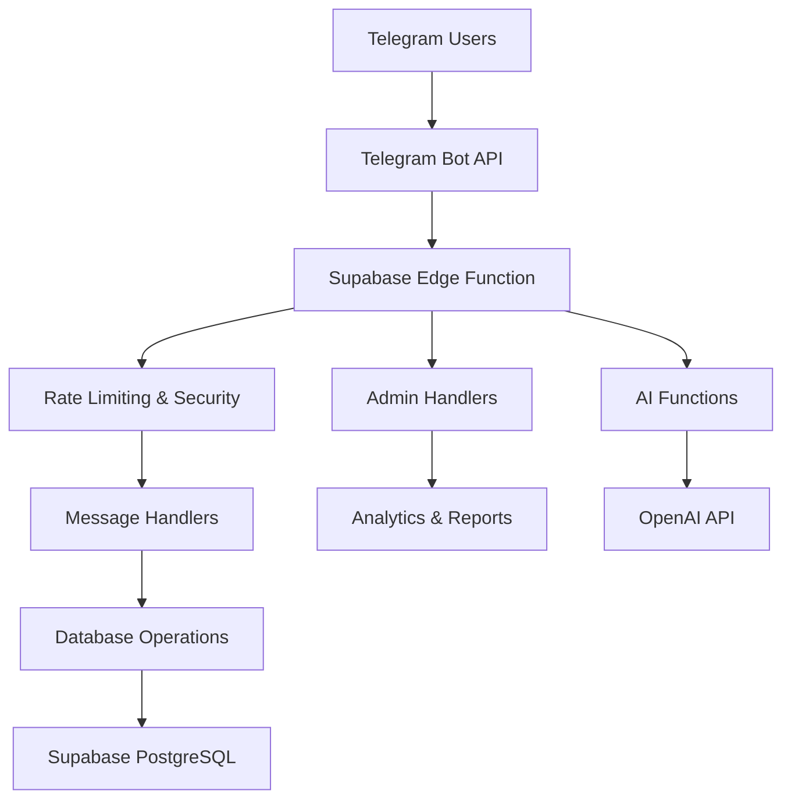

# Dynamic Capital VIP Bot API Documentation

> **AI-Friendly Documentation** - This documentation is optimized for AI code
> generation tools like Codex, ChatGPT, and Bolt.

## 📋 Table of Contents

1. [Project Overview](#project-overview)
2. [Architecture](#architecture)
3. [Database Schema](#database-schema)
4. [API Endpoints](#api-endpoints)
5. [Bot Commands](#bot-commands)
6. [Admin Functions](#admin-functions)
7. [Code Examples](#code-examples)
8. [Development Guidelines](#development-guidelines)

---

## 🚀 Project Overview

The Dynamic Capital VIP Bot is a comprehensive Telegram bot built with
TypeScript, Supabase, and Deno Edge Functions. It manages VIP subscriptions,
education packages, payments, and user interactions.

### Key Features

- 👥 User management with VIP tiers
- 💳 Payment processing (Binance Pay, manual uploads)
- 📚 Education package enrollment
- 📊 Analytics and reporting
- 🎁 Promotion code system
- 📢 Broadcasting capabilities
- 🔒 Advanced security and rate limiting

### Technology Stack

- **Backend**: Supabase (PostgreSQL + Edge Functions)
- **Runtime**: Deno
- **Language**: TypeScript
- **API**: Telegram Bot API
- **AI Integration**: OpenAI GPT models

---

## 🏗️ Architecture



### Core Components

1. **Main Bot Function** (`telegram-bot/index.ts`)
   - Handles all incoming Telegram updates
   - Routes messages to appropriate handlers
   - Manages user sessions and security

2. **Database Utils** (`telegram-bot/database-utils.ts`)
   - Content and settings management
   - VIP package operations
   - User activity tracking

3. **Admin Handlers** (`telegram-bot/admin-handlers.ts`)
   - Administrative dashboard
   - User management
   - System monitoring

---

## 📊 Database Schema

### Core Tables

#### bot_users

```sql
CREATE TABLE bot_users (
  id UUID PRIMARY KEY DEFAULT gen_random_uuid(),
  telegram_id TEXT UNIQUE NOT NULL,
  username TEXT,
  first_name TEXT,
  last_name TEXT,
  is_admin BOOLEAN DEFAULT false,
  is_vip BOOLEAN DEFAULT false,
  current_plan_id UUID,
  subscription_expires_at TIMESTAMPTZ,
  notes TEXT,
  created_at TIMESTAMPTZ DEFAULT now(),
  updated_at TIMESTAMPTZ DEFAULT now()
);
```

#### subscription_plans

```sql
CREATE TABLE subscription_plans (
  id UUID PRIMARY KEY DEFAULT gen_random_uuid(),
  name TEXT NOT NULL,
  price NUMERIC NOT NULL,
  currency TEXT DEFAULT 'USD',
  duration_months INTEGER NOT NULL,
  is_lifetime BOOLEAN DEFAULT false,
  features TEXT[],
  created_at TIMESTAMPTZ DEFAULT now(),
  updated_at TIMESTAMPTZ DEFAULT now()
);
```

#### bot_content

```sql
CREATE TABLE bot_content (
  id UUID PRIMARY KEY DEFAULT gen_random_uuid(),
  content_key TEXT UNIQUE NOT NULL,
  content_value TEXT NOT NULL,
  content_type TEXT DEFAULT 'text',
  description TEXT,
  is_active BOOLEAN DEFAULT true,
  created_by TEXT,
  last_modified_by TEXT,
  created_at TIMESTAMPTZ DEFAULT now(),
  updated_at TIMESTAMPTZ DEFAULT now()
);
```

### Relationships

- `user_subscriptions` → `bot_users` (many-to-one)
- `payments` → `subscription_plans` (many-to-one)
- `education_enrollments` → `education_packages` (many-to-one)
- `promotion_usage` → `promotions` (many-to-one)
  - Unique usage enforced: each `telegram_user_id` can apply a given promotion
    only once

---

## 🔌 API Endpoints

### Edge Functions

#### 1. Telegram Bot (`/telegram-bot`)

**Primary bot function handling all Telegram interactions**

```typescript
// POST https://your-project.supabase.co/functions/v1/telegram-bot
// Webhook endpoint for Telegram Bot API

interface TelegramWebhookBody {
  update_id: number;
  message?: TelegramMessage;
  callback_query?: TelegramCallbackQuery;
}
```

#### 2. Analytics Data (`/analytics-data`)

**Retrieve bot analytics and statistics**

```typescript
// GET https://your-project.supabase.co/functions/v1/analytics-data
// Returns comprehensive bot statistics

interface AnalyticsResponse {
  total_users: number;
  vip_users: number;
  revenue: number;
  daily_interactions: number;
  // ... more metrics
}
```

#### 3. AI FAQ Assistant (`/ai-faq-assistant`)

**AI-powered FAQ responses using OpenAI**

```typescript
// POST https://your-project.supabase.co/functions/v1/ai-faq-assistant
interface FAQRequest {
  question: string;
  user_id: string;
  context?: string;
}

interface FAQResponse {
  answer: string;
  confidence: number;
  sources?: string[];
}
```

---

## 🤖 Bot Commands

### User Commands

#### `/start`

Initialize bot session and show welcome message

```typescript
async function handleStartCommand(message: TelegramMessage): Promise<void> {
  const userId = message.from?.id.toString();
  const chatId = message.chat.id;

  // Create/update user in database
  // Show welcome message with main menu
  // Start user session
}
```

#### `/help`

Display help information and available commands

```typescript
async function handleHelpCommand(chatId: number): Promise<void> {
  const helpContent = await getBotContent("help_message");
  await sendMessage(chatId, helpContent);
}
```

#### `/packages`

Show available VIP packages and subscription options

```typescript
async function handlePackagesCommand(chatId: number): Promise<void> {
  const vipPackages = await getFormattedVipPackages();
  await sendMessage(chatId, vipPackages);
}
```

#### `/vip`

Display VIP membership benefits

```typescript
async function handleVipCommand(chatId: number): Promise<void> {
  const msg = await getBotContent("vip_benefits");
  await sendMessage(chatId, msg);
}
```

### Admin Commands

#### `/admin`

Access admin dashboard (admin only)

```typescript
async function handleAdminCommand(
  chatId: number,
  userId: string,
): Promise<void> {
  if (!isAdmin(userId)) {
    await sendMessage(chatId, "❌ Access denied.");
    return;
  }

  await handleAdminDashboard(chatId, userId);
}
```

---

## 👨‍💼 Admin Functions

### Version Notifications

The bot tracks its code version (bot number) using the `BOT_VERSION` environment
variable. When a new version is deployed, all admins receive a message with the
updated version and the bot automatically refreshes its configuration and
prompts. Admins also receive the current bot number and a status report whenever
they start a new session with `/start`, ensuring the bot number stays current
with each development.

### Dashboard Management

```typescript
/**
 * Display comprehensive admin dashboard
 * Shows system stats, user metrics, and management options
 */
async function handleAdminDashboard(
  chatId: number,
  userId: string,
): Promise<void> {
  // Get system statistics
  const stats = await getDashboardStats();

  // Format admin message
  const adminMessage = formatAdminDashboard(stats);

  // Create admin keyboard
  const keyboard = createAdminKeyboard();

  await sendMessage(chatId, adminMessage, keyboard);
}
```

### User Management

```typescript
/**
 * Manage bot users - view, edit, promote to VIP/admin
 */
async function handleUserTableManagement(
  chatId: number,
  userId: string,
): Promise<void> {
  const users = await getBotUsers({ limit: 50, orderBy: "created_at" });
  const userList = formatUserList(users);

  await sendMessage(chatId, userList, getUserManagementKeyboard());
}
```

### Content Management

```typescript
/**
 * Edit bot messages, welcome text, FAQ responses
 */
async function handleContentManagement(
  chatId: number,
  userId: string,
): Promise<void> {
  const content = await getBotContentList();
  const contentMenu = formatContentMenu(content);

  await sendMessage(chatId, contentMenu, getContentKeyboard());
}
```

---

## 💻 Code Examples

### Creating a New Handler

```typescript
/**
 * Template for creating new bot handlers
 * Copy this template and modify for your specific needs
 */
async function handleNewFeature(
  chatId: number,
  userId: string,
  data?: string,
): Promise<void> {
  try {
    // 1. Validate user permissions
    if (!isAuthorized(userId)) {
      await sendMessage(chatId, "❌ Access denied.");
      return;
    }

    // 2. Get required data from database
    const userData = await getUserData(userId);
    const settings = await getBotSettings(["feature_enabled", "max_usage"]);

    // 3. Process the request
    const result = await processFeatureRequest(userData, data);

    // 4. Update database if needed
    await updateUserActivity(userId, { feature_used: "new_feature" });

    // 5. Send response to user
    const responseMessage = formatFeatureResponse(result);
    const keyboard = createFeatureKeyboard(result);

    await sendMessage(chatId, responseMessage, keyboard);

    // 6. Log admin action if applicable
    if (isAdmin(userId)) {
      await logAdminAction(userId, "feature_access", "Used new feature");
    }
  } catch (error) {
    console.error("🚨 Error in handleNewFeature:", error);
    await sendMessage(chatId, "❌ An error occurred. Please try again.");
  }
}
```

### Database Operations

```typescript
/**
 * Example database operations using Supabase client
 */

// Create a new record
async function createUser(userData: Partial<BotUser>): Promise<BotUser | null> {
  const { data, error } = await supabaseAdmin
    .from("bot_users")
    .insert(userData)
    .select()
    .single();

  if (error) {
    console.error("❌ Error creating user:", error);
    return null;
  }

  return data;
}

// Update existing record
async function updateUserVipStatus(
  userId: string,
  isVip: boolean,
): Promise<boolean> {
  const { error } = await supabaseAdmin
    .from("bot_users")
    .update({
      is_vip: isVip,
    })
    .eq("telegram_id", userId);

  return !error;
}

// Complex query with joins
async function getUserSubscriptionData(userId: string): Promise<any> {
  const { data, error } = await supabaseAdmin
    .from("user_subscriptions")
    .select(`
      *,
      subscription_plans(name, price, features),
      payments(amount, status, created_at)
    `)
    .eq("telegram_user_id", userId)
    .eq("is_active", true);

  return error ? null : data;
}
```

### Message Formatting

```typescript
/**
 * Message formatting utilities for consistent UX
 */

function formatUserList(users: BotUser[]): string {
  return `👥 **User Management**

📊 **Total Users:** ${users.length}

${
    users.map((user, index) =>
      `${index + 1}. ${user.first_name || "Unknown"} (@${
        user.username || "no_username"
      })
   • ID: \`${user.telegram_id}\`
   • Status: ${user.is_vip ? "💎 VIP" : "👤 Regular"}
   • Joined: ${formatDate(user.created_at)}`
    ).join("\n\n")
  }`;
}

function createInlineKeyboard(
  buttons: Array<{ text: string; data: string }>,
): TelegramInlineKeyboardMarkup {
  return {
    inline_keyboard: buttons.map((btn) => [{
      text: btn.text,
      callback_data: btn.data,
    }]),
  };
}
```

---

## 🛠️ Development Guidelines

### Code Style

- Use TypeScript strict mode
- Follow JSDoc comment conventions
- Use descriptive variable and function names
- Implement proper error handling
- Add logging for debugging

### AI Tool Compatibility

- All functions have comprehensive JSDoc comments
- TypeScript interfaces for all data structures
- Clear separation of concerns
- Consistent naming conventions
- Well-documented configuration

### Security Best Practices

- Rate limiting on all endpoints
- Input validation and sanitization
- Admin permission checks
- SQL injection prevention (use Supabase client)
- Sensitive data encryption

### Testing Guidelines

```typescript
/**
 * Example test structure for new features
 */
describe("New Feature Handler", () => {
  it("should handle valid user request", async () => {
    const mockChatId = 123456;
    const mockUserId = "test_user";

    // Mock database responses
    jest.spyOn(supabaseAdmin, "from").mockReturnValue(mockQuery);

    // Test the handler
    await handleNewFeature(mockChatId, mockUserId);

    // Verify expected behavior
    expect(sendMessage).toHaveBeenCalledWith(mockChatId, expect.any(String));
  });
});
```

### Performance Optimization

- Use database functions for complex queries
- Implement caching for frequently accessed data
- Batch operations when possible
- Optimize keyboard layouts for mobile

---

## 🔧 Configuration

### Environment Variables

```bash
# Required
TELEGRAM_BOT_TOKEN=your_bot_token_here
SUPABASE_URL=https://your-project.supabase.co
SUPABASE_SERVICE_ROLE_KEY=your_service_role_key

# Optional
OPENAI_API_KEY=your_openai_key_for_ai_features
BINANCE_API_KEY=for_payment_processing
BINANCE_SECRET_KEY=for_payment_processing
```

### Bot Configuration

```typescript
const BOT_CONFIG = {
  // Rate limiting
  MAX_REQUESTS_PER_MINUTE: 20,
  MAX_COMMANDS_PER_MINUTE: 8,

  // Security
  AUTO_BLOCK_DURATION: 300000, // 5 minutes
  MAX_MESSAGE_LENGTH: 4000,

  // Features
  ENABLE_AI_RESPONSES: true,
  ENABLE_PAYMENT_PROCESSING: true,
  ENABLE_BROADCASTING: true,
};
```

---

## 📚 Additional Resources

- [Telegram Bot API Documentation](https://core.telegram.org/bots/api)
- [Supabase Documentation](https://supabase.com/docs)
- [TypeScript Handbook](https://www.typescriptlang.org/docs/)
- [Deno Manual](https://deno.land/manual)

---

## 🤝 Contributing

This codebase is designed to be easily understood and modified by AI tools. When
making changes:

1. Update type definitions in `types/telegram-bot.ts`
2. Add JSDoc comments to new functions
3. Follow the existing code patterns
4. Update this documentation
5. Test with multiple AI tools for compatibility

---

_This documentation is optimized for AI code generation tools. All functions,
interfaces, and patterns are designed to be easily understood and extended by
Codex, ChatGPT, Bolt, and similar AI assistants._
